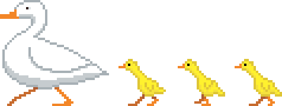

# Momma Duck

> _**[Play the game!](https://levi.dev/gmtk21)**_

_Collect your ducklings and lead them to safety!_

TODO: Game technical description

This game was created in 48-hours as a submission for the [GMTK 2021 game jam](https://itch.io/jam/gmtk-2021). All design, code, images, sound effects, and music were created by Levi.

## Theme: "Joined together"

TODO: Describe how the game addresses the theme.

## Software used

-   **[Godot](https://godotengine.org/)**: Game engine.
-   **[Aseprite](https://www.aseprite.org/)**: Pixel-art image editor.
-   **[Bfxr](https://www.bfxr.net/)**: Sound effects editor.
-   **[DefleMask](https://deflemask.com/)**: Chiptune music tracker.
-   **[Scaffolder](https://godotengine.org/asset-library/asset/969)**: A framework from the Godot Asset Library that provides some general app infrastructure.
    -   Here are some of the features used:
        -   UI and camera scaling to adapt to the current viewport.
        -   Analytics.
        -   Automatic crash log reporting.
        -   Screen layout and navigation.
        -   Utility functions (e.g., Time, Geometry, DrawUtils, Audio).
        -   A widget library (e.g., AccordionPanel, LabeledControlList).
-   **[Surfacer](https://godotengine.org/asset-library/asset/968)**: A framework from the Godot Asset Library that provides procedural path-finding across 2D platforms.

## Licenses

-   The code is published under the [MIT license](LICENSE).
-   The art assets (files under `assets/images/`, `assets/music/`, and `assets/sounds/`) are published under the [CC0 1.0 Universal license](https://creativecommons.org/publicdomain/zero/1.0/deed.en).
-   This project depends on various pieces of third-party code that are licensed separately. Here are lists of these third-party licenses:
    -   [addons/scaffolder/src/config/scaffolder_third_party_licenses.gd](https://github.com/SnoringCatGames/scaffolder/blob/master/src/config/scaffolder_third_party_licenses.gd)
    -   [addons/surfacer/src/config/surfacer_third_party_licenses.gd](https://github.com/SnoringCatGames/surfacer/blob/master/src/config/surfacer_third_party_licenses.gd)
    -   [src/config/third_party_licenses.gd](./src/config/third_party_licenses.gd)

  

