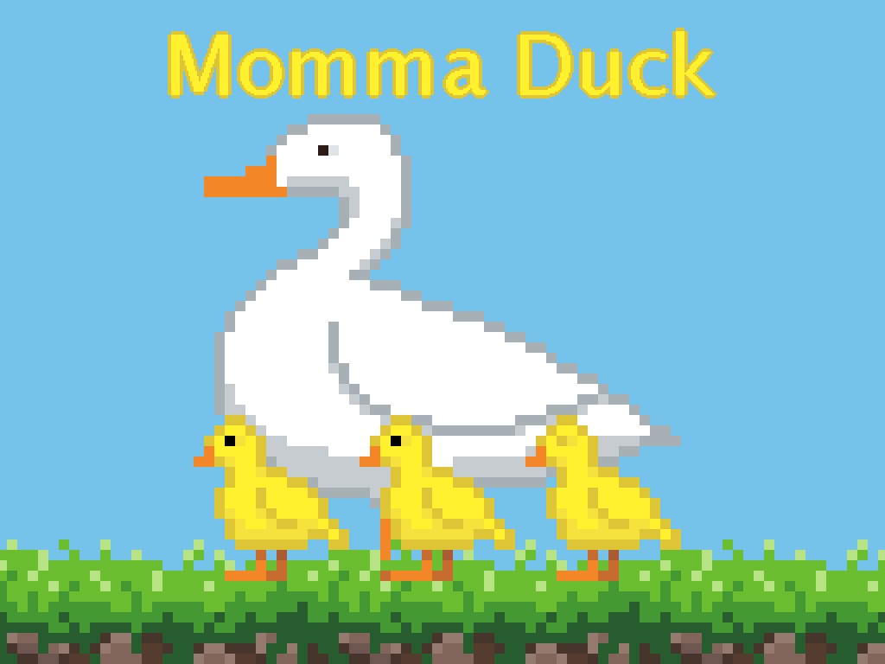

# Momma Duck

> _**Note:** This is the original version of the game that was submitted to GMTK 2021. [An updated version of the game is here](https://github.com/SnoringCatGames/momma-duck)._

> _**[Play the game!](https://levi.dev/gmtk21)**_
> 
> _**[Watch the gameplay video!](https://www.youtube.com/watch?v=QYv0xNa0bO8)**_

  

> _Collect your ducklings and lead them to safety!_

> This is a **point-and-click platformer**!

This game was created in 48-hours as a [submission](https://itch.io/jam/gmtk-2021/rate/1085910) for the [GMTK 2021 game jam](https://itch.io/jam/gmtk-2021). All design, code, images, sound effects, and music were created by [Levi](https://levi.dev).

## The theme: "Joined together"

You are a momma duck. Your precious ducklings follow closely behind you as you lead them to a safe pond.

## What exactly existed before the start of the jam?

If you think this looks polished and like way too much for a single person to have done in just two days, you're right! But most of the really impressive stuff is from a couple open-source Godot Asset Library packages: [Scaffolder](https://godotengine.org/asset-library/asset/969) and [Surfacer](https://godotengine.org/asset-library/asset/968).

-   The Scaffolder library:
    -   This mostly adds the GUI and screen-layout you see before actually starting a level.
-   The Surfacer library:
    -   This mostly adds pathfinding.
        -   Parsing tile maps into platform graphs of navigable surfaces.
        -   Calculating paths through the graph and executing movement through these paths.
        -   Annotating stuff relating to these paths.

## Software used

-   **[Godot](https://godotengine.org/)**: Game engine.
-   **[Aseprite](https://www.aseprite.org/)**: Pixel-art image editor.
-   **[Bfxr](https://www.bfxr.net/)**: Sound effects editor.
-   **[DefleMask](https://deflemask.com/)**: Chiptune music tracker.
-   **[Scaffolder](https://godotengine.org/asset-library/asset/969)**: A framework from the Godot Asset Library that provides some general app infrastructure (like GUI layout and screen navigation).
-   **[Surfacer](https://godotengine.org/asset-library/asset/968)**: A framework from the Godot Asset Library that provides procedural path-finding across 2D platforms.

## Licenses

-   The code is published under the [MIT license](LICENSE).
-   The art assets (files under `assets/images/`, `assets/music/`, and `assets/sounds/`) are published under the [CC0 1.0 Universal license](https://creativecommons.org/publicdomain/zero/1.0/deed.en).
-   This project depends on various pieces of third-party code that are licensed separately. Here are lists of these third-party licenses:
    -   [addons/scaffolder/src/config/scaffolder_third_party_licenses.gd](https://github.com/SnoringCatGames/scaffolder/blob/master/src/config/scaffolder_third_party_licenses.gd)
    -   [addons/surfacer/src/config/surfacer_third_party_licenses.gd](https://github.com/SnoringCatGames/surfacer/blob/master/src/config/surfacer_third_party_licenses.gd)
    -   [src/config/third_party_licenses.gd](./src/config/third_party_licenses.gd)

  

